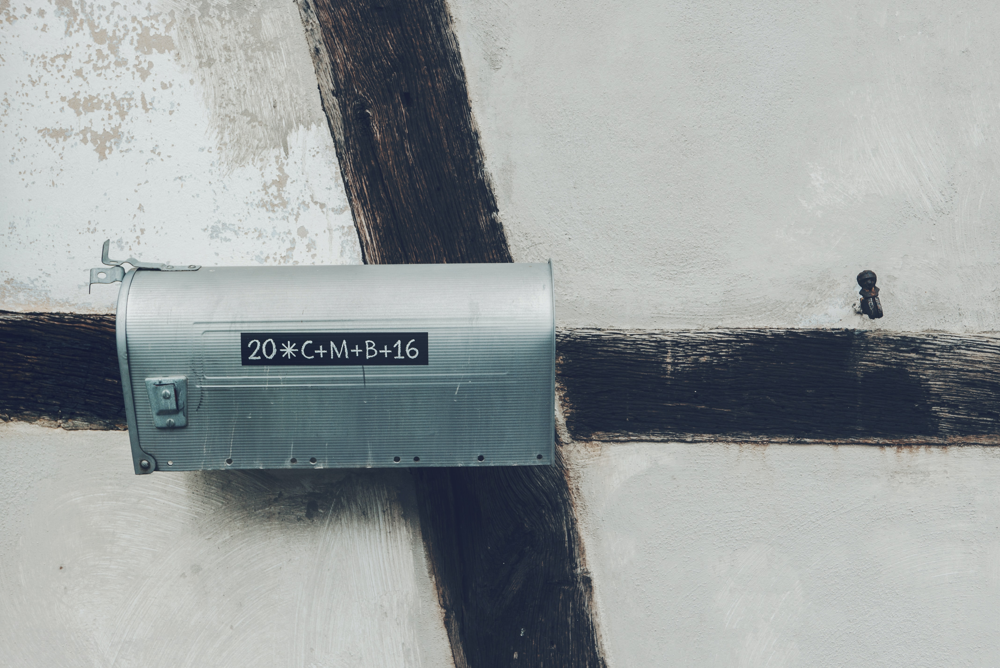

こんにちは、Kazu です。
IP アドレスについて一通り学習したのでまとめていきたいと思います。  
（誤りやご意見等ありましたらツイッターにてよろしくお願いします）

#### 目次

<!-- @import "[TOC]" {cmd="toc" depthFrom=2 depthTo=3 orderedList=false} -->

<!-- code_chunk_output -->

- [IP アドレスとは何か](#ip-アドレスとは何か)
- [IP アドレスの基礎](#ip-アドレスの基礎)
  - [32bit で表される](#32bit-で表される)
  - [実際に 32bit の 2 進数 に変換してみる](#実際に-32bit-の-2-進数-に変換してみる)
  - [ネットワーク部とホスト部](#ネットワーク部とホスト部)
- [IP アドレスは 2 種類存在する](#ip-アドレスは-2-種類存在する)
  - [グローバル IP アドレス](#グローバル-ip-アドレス)
  - [プライベート IP アドレス](#プライベート-ip-アドレス)

<!-- /code_chunk_output -->

## IP アドレスとは何か

IP アドレスとは一言で表すと、**「ネットワーク上の住所」** です。

ネットワーク上でデータのやりとりを行う際にはパケットを交換する「パケット交換方式」が採用されています。  
（パケット交換方式については **【作成予定】こちらの記事** をご覧ください）

その中で、パケットをルータ・ホスト（PC やスマホなど）などに送信する際に IP アドレスは使用されます。

## IP アドレスの基礎

IP アドレスとは具体的に以下のようなものです。

`192.168.1.0`

エンジニアや PC をよく触る人には馴染みのあるものだと思います。  
ではこの IP アドレスはどのように構成されているのでしょうか。

### 32bit で表される

実は IP アドレスは下記の例のように　**32bit の 2 進数**　で表されます。

`例) 00000111000010000000000000000001`

※ 32bit というのは 2 進数上で 32 桁の数値という意味です。  
2 進数がわからない人はネットで調べてみてください。

しかし、人間からすると 32 桁もの数値を覚えるのは困難なため、一般的に「192.168.1.0」のように 10 進数に変換されます。  
ちなみにこの表記法は、**ドット付き 10 進表記法** と呼ばれています。

### 実際に 32bit の 2 進数 に変換してみる

上の説明だけではわかりにくいと思うので、実際に 32bit の 2 進数に変換してみたいと思います。  
下記の IP アドレスを例に変換します。

`192.168.1.0`

192 (10 進数) => 11000000 (8bit の 2 進数)  
168 (10 進数) => 10100010 (8bit の 2 進数)  
1 (10 進数) => 00000001 (8bit の 2 進数)  
0 (10 進数) => 00000000 (8bit の 2 進数)

（10 進数を 2 進数に変換する方法は **【作成予定】こちらの記事** を参考にしてください）

つまり、この IP アドレス を 32bit の 2 進数に変換すると以下のようになります。  
192.168.1.0 => 11000000 10100010 00000001 00000000

本記事で後述するネットワークアドレスやブロードキャストアドレスなどを理解するためには必須の知識です。  
またルーティングなどを行う際、ハードウェアは 32bit の 2 進数に変換して処理を行うため、  
IP を学習したいエンジニアは 10 進数から 2 進数への変換はぜひ覚えてください。

### ネットワーク部とホスト部

IP アドレスはネットワーク部とホスト部で構成されています。  
ネットワーク部・ホスト部を考える時は 2 進数に変換します。

先頭から ● 桁までを**ネットワーク部**、(● は指定されている、構築する場合は指定することが可能)  
それ以降から最終桁までを**ホスト部**といいます。

具体例を示します。

例)

`192.168.1.0/25`  
`11000000 10100010 00000001 00000000`

上記の場合、32bit の 2 進数の 25 桁目までがネットワーク部となり、残りがホスト部となります。  
わかりやすいようにネットワーク部とホスト部で色分けすると以下のようになります。

11000000 10100010 00000001 00000000  
ネットワーク部 ホスト部

## IP アドレスは 2 種類存在する

IP アドレスは 2 種類あります。  
それは、グローバル IP アドレスとプライベート IP アドレスです。

### グローバル IP アドレス

**全ネットワーク上でたった一つしか存在しない IP アドレス**のことです。  
唯一のという意味で ユニークな IP アドレス とネットワークの世界ではよく呼ばれます。

### プライベート IP アドレス

**全ネットワーク上で重複してもよいが、私的なネットワーク内ではユニークな IP アドレス**のことです。

