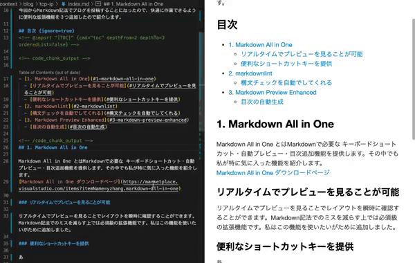

こんにちは、カイザーです。
今回から Markdown 記法でブログを投稿することになったので、快適に作業できるように便利な拡張機能を３つ追加したので紹介します。

## 目次

<!-- @import "[TOC]" {cmd="toc" depthFrom=3 depthTo=4 orderedList=false} -->
<!-- code_chunk_output -->

- [1. Markdown Preview Enhanced](#1-markdown-preview-enhanced)
  - [リアルタイムでプレビューを見ることが可能](#リアルタイムでプレビューを見ることが可能)
  - [目次の自動生成](#目次の自動生成)
- [2. Markdown All in One](#2-markdown-all-in-one)
  - [便利なショートカットキーを提供](#便利なショートカットキーを提供)
- [3. markdownlint](#3-markdownlint)
  - [自動で構文チェック](#自動で構文チェック)

<!-- /code_chunk_output -->

### 1. Markdown Preview Enhanced

[Markdown Preview Enhanced 公式ドキュメント](https://shd101wyy.github.io/markdown-preview-enhanced/#/)

#### リアルタイムでプレビューを見ることが可能

リアルタイムでプレビューを見ることでレイアウトを瞬時に確認することができます。Markdown 記法でのミスを減らす上では必須級の拡張機能です。

#### 目次の自動生成

Markdown Preview Enhanced では目次を自動で生成してくれる機能が備わっています。

以下、目次を自動で生成する方法です。

1. マークダウンファイルを開いた状態で、コマンドパレット（F1 または Ctrl + Shift + P）を開き、「Markdown Preview Enhanced: Create TOC」を実行します。

2. `<!-- @import "[TOC]" {cmd="toc" depthFrom=1 depthTo=6 orderedList=false} -->`が生成されるので、目次を表示したい箇所にそのコードを記述します
   (depthFrom=1 => h1 タグは「目次」を表す。depthTo=6 => h6 タグは「目次の見出し」)

3. h1 タグ、h6 タグ(修正可能)を追加すれば自動で目次を生成します。また、目次に載せたくないタグに関しては {ignore = true} を設定することで追加しないようにすることもできます。`ex) ### HogeHoge {ignore=true}`

### 2. Markdown All in One

[Markdown All in One 公式ドキュメント](https://marketplace.visualstudio.com/items?itemName=yzhang.markdown-all-in-one)

#### 便利なショートカットキーを提供

作業効率を高める為のショートカットキーを提供してくれます。
以下ショートカットキーの一覧です。（公式ドキュメントからの引用)

**Ctrl / Cmd + B**
太字を切り替え

**Ctrl / Cmd + I**
イタリックに切り替える

**Ctrl / Cmd + Shift +]**
見出しの切り替え（上位）

**Ctrl / Cmd + Shift + [**
見出しの切り替え（下位レベル）

**Ctrl / Cmd + M**
数学環境を切り替える

**Alt + C**
タスクリスト項目のチェック/チェック解除

**Ctrl / Cmd + Shift + V**
プレビューを切り替え

**Ctrl / Cmd + KV**
プレビューを横に切り替え

### 3. markdownlint

[markdownlint 公式ドキュメント](https://github.com/DavidAnson/markdownlint)

#### 自動で構文チェック

markdown 記法に則って間違った記述を厳密に指摘してくれます。
エンジニアにとって Linter は必需品です。ぜひ入れましょう。

これらの拡張機能を追加するだけで非常に快適に編集することができます。ぜひ試してみてください。

