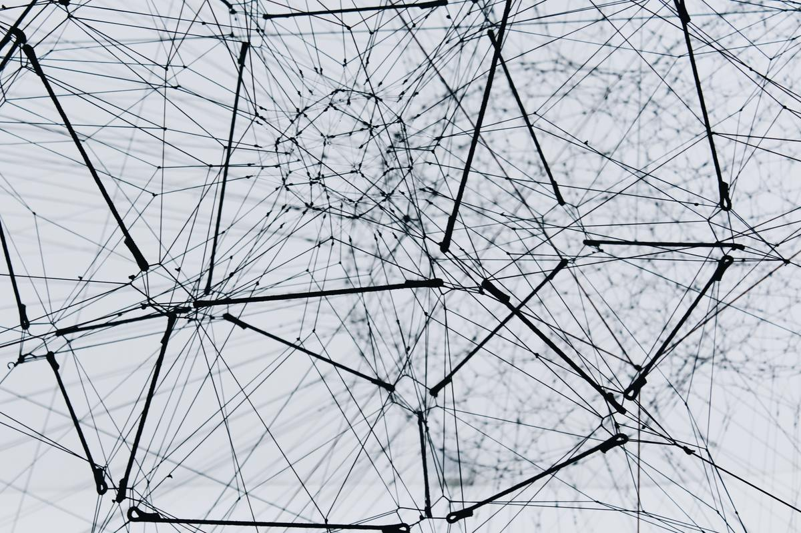

こんにちは、カイザーです。
今回はエンジニアとして働く上で避けては通れない TCP/IP について解説していきます。

TCP/IP の重要な特徴は以下の 2 つです。

---

・異なるネットワーク間で通信を可能にする技術 
・パケット交換方式で通信

---

### 1. 異なるネットワーク間で通信を可能にする技術

 
// ここに図を
 
 
 

TCP/IP では上図のように<b>独立したネットワーク間での通信を可能にします。</b>

従来の通信技術では独立したネットワークではそのネットワーク内でしか通信をすることができませんでした。 

なぜ TCP/IP は独立したネットワーク間での通信が可能かといいますと、 
TCP/IP は多くの企業や研究期間が共同で開発しているため、ネットワーク業界では中核時術として扱われ、 
多くの機器で TCP/IP が利用されているからです。 
皆さんの身の回りにある機器(PC、スマホ、受話器 など)はなんでもかんでも TCP/IP が使用されています。 
 
<b>ネットワーク利用するなら絶対 TCP/IP !!!</b>
 
 
といった感じでネットワーク業界で TCP/IP は切っても切れない存在ということですね笑

