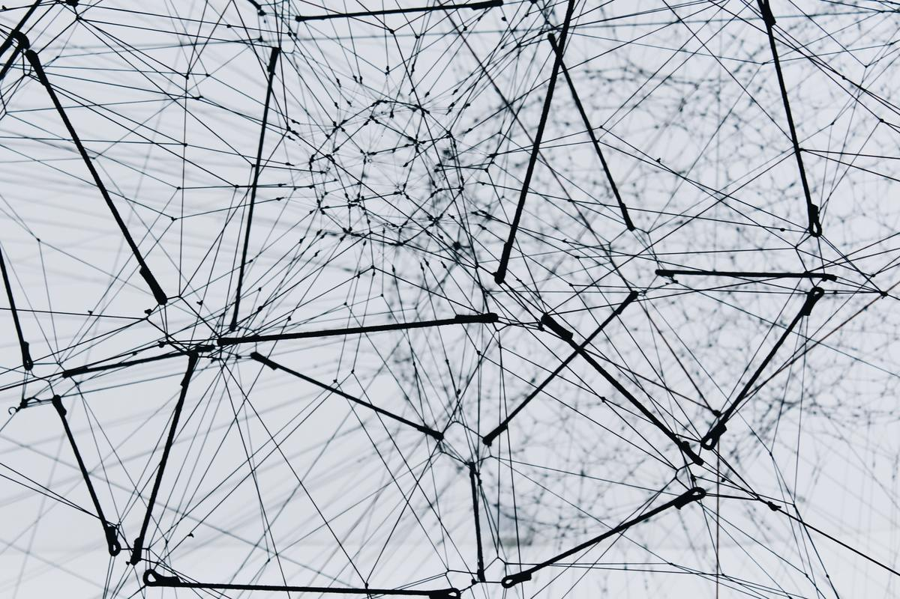

こんにちは、カイザーです。
今回はエンジニアとして働く上で避けては通れない TCP/IP について解説していきます。

TCP/IP の重要な特徴は以下の 4 つです。

1. 異なるネットワーク間で通信を可能にする技術

2. オープンなプロトコルでありネットワーク業界の中核技術

3. 世に出回っている機器はなんでもかんでも TCP/IP に対応している

4. パケット交換方式で通信

